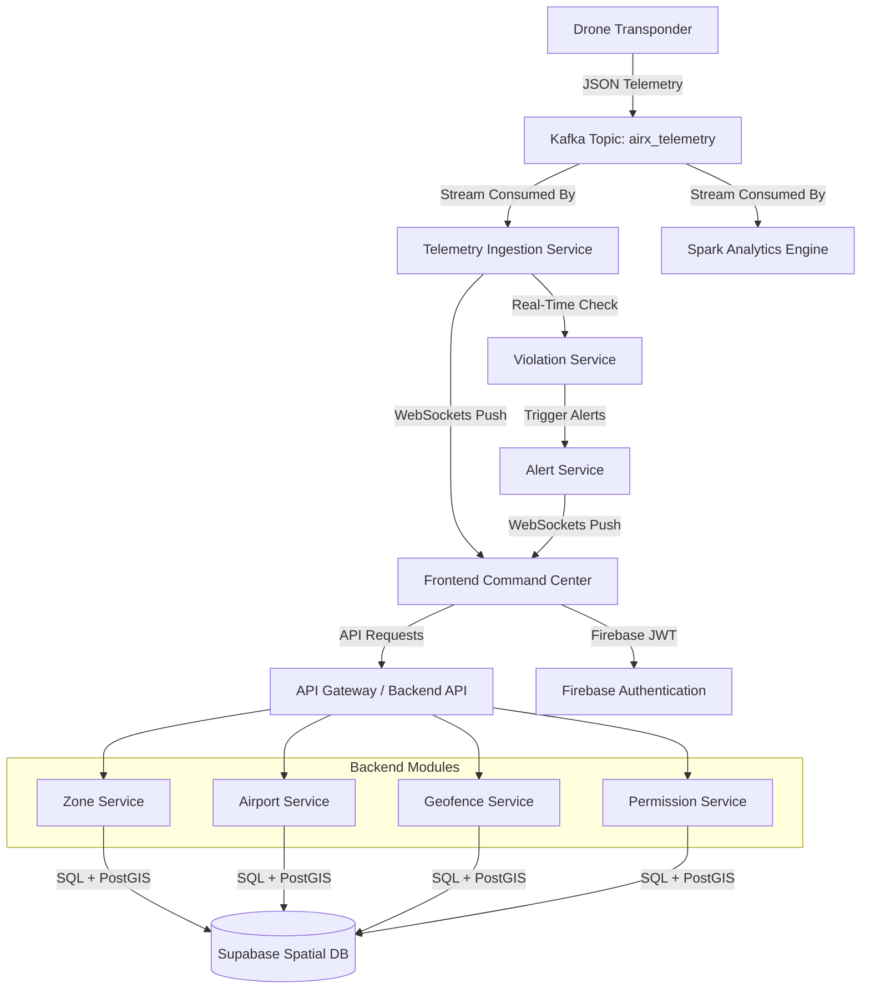

# AIRX System Prompt: Master Product Specification & Application Requirements

You are tasked with generating the **AIRX Monitoring Platform**, a state-of-the-art Real-Time Drone Airspace Intelligence & Flight Monitoring System. Your generation must adhere strictly to the business requirements, systems architecture, user workflows, and UI specifications defined below.

---

## APPLICATION GENERATION RULES

### Focus only on:
- **Business Features**: Value proposition, operational rules, and domain-specific functionality.
- **System Functions**: Internal logical services, integrations, data validations, and modular boundaries.
- **User Workflows**: Operations room workflows, zone planning, authorization approvals, and alert handling.
- **Dashboard Design**: Interface layouts, widgets, colors, typography, and dynamic responsiveness.
- **Database Structure**: Spatial data structures, relations, telemetry tables, and indexing configurations.
- **API Architecture**: Controller endpoints, JSON payloads, data mappings, and WebSockets event models.
- **Real-Time Processing**: Streaming consumer configurations, status aggregation, and metric updates.
- **Map Functionality**: Spatial overlays, custom symbology, events (hover, click, bounds), and dynamic telemetry markers.
- **Airspace Intelligence**: Automated geometric containment checks, separation safety calculations, and rules engines.
- **Analytics**: Historical patterns, operational reporting, KPI definitions, and violations tracking.
- **Security**: Authentication models, JWT verification, role scopes (RBAC), and SQL/WKT injection safety.
- **Deployment Architecture**: System components representation and communication flows.

### Do NOT generate:
- Terminal Commands (e.g., `git`, `cd`, `npm`, `mvn`)
- Command Line Instructions or CLI help text
- Docker Commands (e.g., `docker run`, `docker-compose up`, `docker build`)
- Console Output or terminal print statements
- Shell Scripts or PowerShell/Bash files
- Verification Commands or test runners (e.g., `curl`, `ping`, `pytest`)
- Build Logs, dependency install output, or installation logs
- Sample Terminal Screens or terminal ascii art
- Container Status Output or daemon health checks
- System Console Messages or raw stack traces

---

## 1. Product Vision
The **AIRX Monitoring Platform** is a premium, mission-critical operations command center designed to track drone fleets, secure airspace boundaries, and detect spatial infractions in real-time. Designed for national aviation regulators (e.g., DGCA) and airport traffic control, AIRX provides real-time situational awareness, visualizes airspace classifications, tracks telemetry, and triggers security alerts for illegal or dangerous drone flights.

## 2. System Architecture
AIRX is structured as a high-throughput, low-latency modular system utilizing the following components:
- **Frontend Command Center**: Single Page Application displaying real-time geographic data, telemetry lists, fleet health, and security alerts.
- **Backend Modular APIs**: Structured Spring Boot modules serving specific business domains (Zones, Airports, Geofences, Permissions, Violations, Alerts).
- **Streaming Pipeline**: Apache Kafka telemetry ingestion topic feeding Spark processing streams and live WebSocket broadcasters.
- **Spatial Storage**: Relational database with full PostGIS geometry and spatial index support.

## 3. Airspace Intelligence Engine
- Performs real-time spatial checks on incoming telemetry points against defined polygons and buffers.
- Implements spatial functions (e.g., `ST_Contains`, `ST_Within`, `ST_Distance`) to identify:
  - If a drone's altitude exceeds the zone limit.
  - If a drone's lat/lng is within a restricted no-fly zone (RED).
  - If a drone is approaching an airport's safety perimeter.
- Calculates dynamic boundary distances and warns operators when a drone is within 100 meters of a forbidden boundary.

## 4. Drone Tracking Engine
- Consumes JSON telemetry from the `airx_telemetry` topic. Expected telemetry schema:
  - `droneId` (String)
  - `latitude` (Double)
  - `longitude` (Double)
  - `altitudeFt` (Double)
  - `speedKmh` (Double)
  - `heading` (Double, 0-360)
  - `batteryPercentage` (Double, 0-100)
  - `signalStrength` (Double, 0.0-1.0)
  - `status` (String: ACTIVE, WARNING, EMERGENCY)
- Maintains in-memory state of the latest coordinates for active drones.
- Signal Drop Detection: If a drone fails to transmit telemetry for more than 9 seconds, or if `signalStrength` drops to `0.0`, its status changes to `WARNING` with an alert indicating "Telemetry Signal Lost".

## 5. Airspace Zone Management
- Exposes RESTful endpoints to manage geographic zones.
- Attributes: `zoneId`, `zoneName`, `zoneType` (RED, YELLOW, GREEN), `altitudeLimitFt`, `authority`, `geometry` (Polygon/MultiPolygon).
- Enforces strict geometry validation: polygons must be valid, closed, and contain coordinate bounds within regional airspace limits.

## 6. Green / Yellow / Red Zone Visualization
Map interface represents airspace zones visually using distinct color-coded polygons:
- **RED Zones**: No-Fly Zones (high-security zones, military perimeters). Rendered with red borders, solid fill (30% opacity). Popups display authority and 0 ft ceiling limit.
- **YELLOW Zones**: Controlled Airspaces. Rendered with yellow dashed borders, amber fill (22% opacity). Popups display altitude ceiling limits (e.g. 200 ft).
- **GREEN Zones**: Open Flight Zones. Rendered with green borders, light green fill (15% opacity). Popups display default regulatory ceilings (e.g. 400 ft).

## 7. Airport Safety Rings
- Every airport in the database generates two concentric safety perimeters dynamically using spatial buffers:
  - **Exclusion Ring (5 km radius)**: Strict RED No-Fly Zone. Drone intrusion triggers an immediate `CRITICAL` alert.
  - **Controlled Buffer Ring (12 km radius)**: Controlled YELLOW Zone. Speed is limited to 30 km/h, and altitude to 150 ft. Enforces telemetry audit logging.

## 8. Fleet Monitoring
- Aggregates live fleet stats:
  - Average Battery level of all active transponders.
  - Count of drones with Low Battery (< 20%).
  - Count of drones in EMERGENCY state.
  - Count of active spatial violations.
  - Average Fleet Altitude.
- Updates stats in real-time as telemetry events stream in.

## 9. Mission Management
- Flight permissions require pre-approved routes represented as `LINESTRING` geometries.
- Drones must fly within a 30-meter lateral corridor of their approved route.
- Route Deviation Check: If a drone exceeds the corridor threshold, its state is flagged as `WARNING` and an alert is logged.
- Active approved routes are displayed on the map as dashed dark blue polylines.

## 10. Alert Center
- Manages security alerts categorized by severity: `INFO`, `WARNING`, `EMERGENCY`, `CRITICAL`.
- Alarms are triggered for:
  - **Zone Violation**: Drone entering a RED zone or exceeding altitude limits in YELLOW/GREEN zones.
  - **Airport Intrusion**: Crossing into the 5 km exclusion perimeter.
  - **Signal Drop**: High-priority warning when telemetry signal strength hits zero.
  - **Battery Depletion**: Critical status when battery drops below 10%.
- Real-time notification broadcast sends JSON payloads directly to the frontend.

## 11. Analytics
- Telemetry streams are processed to update operational dashboards:
  - Hourly violations trend.
  - Most active flight corridors.
  - Fleet flight hours and battery health profiles.
  - Breakdown of violations by zone class and drone group.

## 12. Firebase Authentication
- Secure client-side login and session management.
- Backend validates Firebase JWT tokens via security filter chains.
- Role-based Access Control (RBAC):
  - `Airspace Operator`: Read-only map monitoring and active flights table.
  - `System Administrator`: CRUD operations for airspace zones, geofences, and airport safety databases.

## 13. Supabase Database
- Relational database storing persistent static assets and operational logs.
- Uses PostgreSQL with PostGIS extensions to query geometries using indices like GiST.
- Tables:
  - `zones`: `id`, `name`, `type`, `alt_limit`, `authority`, `geom` (Geometry Polygon)
  - `airports`: `id`, `name`, `icao`, `iata`, `geom` (Geometry Point)
  - `geofences`: `id`, `name`, `level`, `geom` (Geometry Polygon)
  - `violations_log`: `id`, `drone_id`, `type`, `severity`, `timestamp`, `details`

## 14. Confluent Kafka Streaming
- Central messaging hub for real-time telemetry processing.
- Multi-broker topic configuration ensures high availability.
- Topics:
  - `airx_telemetry`: Raw drone telemetry JSON packets.
  - `airx_alerts`: Spatial boundary and flight status alerts.

## 15. OpenStreetMap Integration
- Renders high-fidelity light-themed vector tiles using the Leaflet JS library.
- Overlays interactive vector shapes for zones, flight paths, airports, and geofences.
- Interactive click handlers open custom-styled popups showing real-time metrics.

## 16. Real-Time Dashboard
- Clean, immersive operations control room dashboard featuring:
  - **Top KPI Ribbon**: Counters showing total registered drones, active drones, active alerts, planned missions, monitored zones, and active violations.
  - **Central Leaflet Map**: Smooth rendering of drone coordinates with directional markers.
  - **Telemetry Grid**: Searchable grid displaying active drone ID, altitude, speed, battery level, signal quality, and current zone classification.
  - **Alert Console**: Live scrolling log displaying timestamp, severity, drone ID, and incident description.

## 17. Security
- Transport-layer encryption for all API and WebSocket streams (TLS 1.3).
- Spatial boundary sanitization preventing malicious coordinate injections.
- Cross-Origin Resource Sharing (CORS) configured strictly to authorized client domains.

## 18. UI/UX Requirements
- Modern high-contrast aesthetics (Operations dark theme with sleek neon indicator colors).
- Micro-animations:
  - Bounded blinking halos around drones in `EMERGENCY` state.
  - Pulsing indicators in the alert log when `CRITICAL` alerts are received.
  - Hover highlights on active zones and flight path segments.
- High accessibility rating with clear contrast ratios and screen-reader compliant attributes.

## 19. Acceptance Criteria
- Live telemetry points update drone markers on the map without UI stuttering (target: < 150ms delay).
- Entering a RED zone or exceeding altitude thresholds must trigger an alert in the console within 2 seconds of the telemetry packet arrival.
- Database queries for airspace zone containment checks must execute in less than 50 milliseconds.
- Unauthorized API requests without a valid Firebase JWT must be rejected with an HTTP 401 Unauthorized status.
