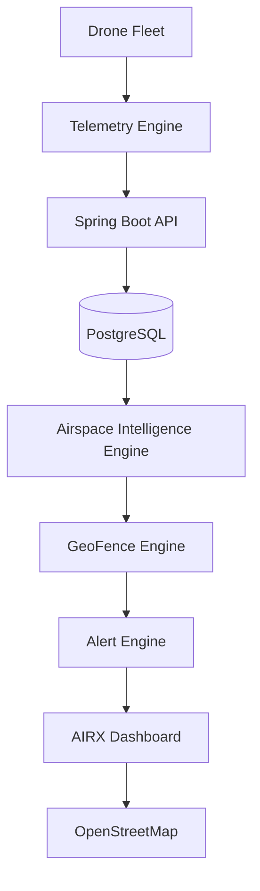
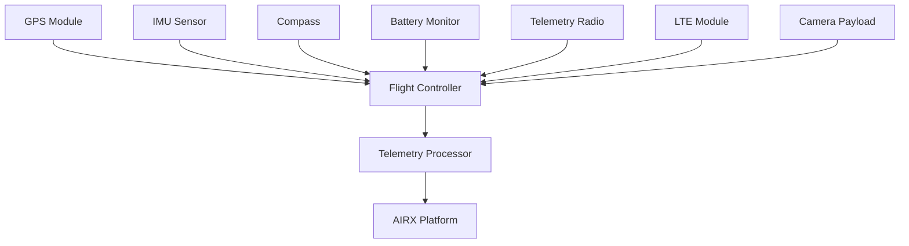

# AIRX Monitoring Platform™
**Real-Time Drone Airspace Intelligence & Flight Monitoring Platform**
## Overview
AIRX Monitoring Platform is a real-time drone airspace intelligence and flight monitoring system designed for commercial drone operators, logistics providers, survey teams, emergency response organizations, and autonomous fleet operators.
The platform provides live drone tracking, airspace awareness, geo-fencing, airport proximity monitoring, mission visibility, operational alerts, and fleet intelligence through an interactive aviation-grade monitoring dashboard. AIRX focuses on operational safety, airspace awareness, flight visibility, and real-time situational intelligence.
## Core Capabilities
 * Real-Time Drone Tracking
 * Live Airspace Visualization
 * Green Zone Monitoring
 * Yellow Zone Monitoring
 * Red Zone Restriction Detection
 * Airport Safety Radius Monitoring
 * Geo-Fencing Enforcement
 * Fleet Monitoring
 * Flight Path Visualization
 * Mission Monitoring
 * Alert Management
 * Battery Monitoring
 * Signal Quality Monitoring
 * Flight History Tracking
 * Airspace Intelligence Analytics
 * Aviation Operations Dashboard
## Airspace Intelligence Architecture

## Airspace Zone Classification
| Zone Type | Description | Operational Rules |
|---|---|---|
| **Green Zone** | Safe operational area. | Flight operations allowed. Maximum recommended altitude: 400 ft. |
| **Yellow Zone** | Caution area. | Additional operational checks required. Airport proximity monitoring enabled. Altitude restrictions may apply. |
| **Red Zone** | Restricted area. | Flight operations not recommended. Continuous monitoring and alert generation enabled. |
## Airport Safety Monitoring
AIRX continuously evaluates drone distance from airports and controlled airspace.
**Monitoring Layers:**
 * Airport Boundary
 * Airport Safety Radius
 * Flight Restriction Areas
 * Airport Proximity Alerts
 * Route Risk Analysis
## Drone Hardware Architecture

## Drone Telemetry
AIRX collects critical flight data. Every dashboard value originates from recorded telemetry; **no estimated values are displayed**.
 * Latitude & Longitude
 * Altitude & Speed
 * Heading
 * Battery Percentage & Temperature
 * Signal Strength
 * Mission Status
 * GPS Accuracy
 * Flight Duration & Distance Travelled
## GeoFence Monitoring
AIRX continuously monitors operational limits and generates immediate alerts for zone violations.
**Monitored Areas:**
 * Flight Boundaries
 * Restricted Areas
 * Mission Zones
 * Airport Zones
 * Emergency Zones
**Alert Triggers:**
 * Zone Entry & Exit
 * Route Deviation
 * Airport Proximity
 * Restricted Area Violation
## Flight Monitoring Dashboard
The map serves as the primary operational interface, providing immediate situational awareness.
 * Live Drone Locations & Flight Paths
 * Fleet & Mission Status
 * Alert Feed
 * Airspace Zones
 * Battery Status & Signal Health
 * Airspace Analytics
### Operational Dashboard Layout
```text
AIRX Monitoring Platform
┌──────────────────────────────────────┐
│ Fleet │ Missions │ Airspace │ Alerts │
├──────────────────────────────────────┤
│                                      │
│                                      │
│        LIVE AIRSPACE MAP             │
│                                      │
│                                      │
├─────────────┬─────────────┬──────────┤
│ Fleet       │ Alerts      │ Health   │
└─────────────┴─────────────┴──────────┘

```
## Technology Stack
| Domain | Technologies |
|---|---|
| **Frontend** | React, TypeScript, Material UI, Leaflet, OpenStreetMap |
| **Backend** | Spring Boot, Java 21, REST API, WebSocket |
| **Database** | PostgreSQL, Supabase |
| **Authentication** | Firebase Authentication, JWT |
| **Hosting** | Firebase Hosting, Render |
## Security
AIRX follows a **Zero Trust** operational model.
 * Firebase Authentication
 * JWT Validation
 * Role-Based Access Control
 * HTTPS Encryption
 * Audit Logging
 * API Validation
 * Secure Session Management
## Real-Time Monitoring
AIRX provides live, unestimated visibility into operational metrics. All displayed information originates strictly from stored telemetry and verified records.
 * Active Drones & Airspace Activity
 * Mission Status
 * Battery Levels & Signal Quality
 * Airport Proximity & Zone Violations
 * Operational Alerts
## Project Structure
```text
airx-monitoring-platform/
├── backend/
├── frontend/
│   ├── airx-web/
│   └── airx-admin/
├── database/
├── gis/
├── infrastructure/
├── scripts/
├── streaming/
├── testing/
├── docs/
└── airflow/

```
## Future Roadmap
 * Autonomous Mission Planning
 * AI-Assisted Flight Risk Detection
 * Advanced Airspace Analytics
 * Multi-Fleet Operations
 * Satellite Tracking Integration
 * Weather Intelligence Layer
 * Predictive Maintenance
 * Remote Fleet Operations Center
## License
**AIRX Monitoring Platform™**
Internal Development Project.
*All flight operations, monitoring decisions, and airspace intelligence outputs must be validated through telemetry, operational rules, and verified data sources.*
