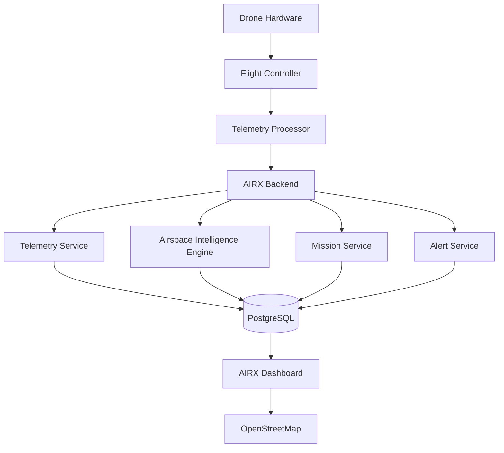
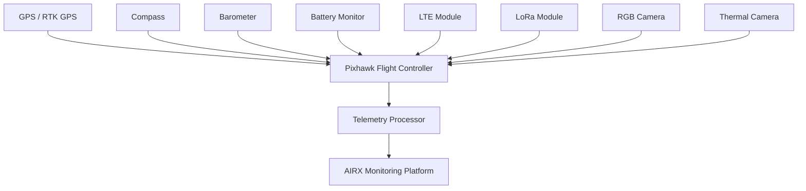

# AIRX Monitoring Platform™


---
## Live Demo

🌐 **AIRX Monitoring Platform**

**Web Dashboard:** https://airx-monitoring.web.app

**System Status:** Online

---
AIRX Monitoring Platform

AIRX Monitoring Platform is a real-time drone airspace intelligence and fleet monitoring system designed for autonomous drones, commercial drone operators, agriculture services, survey missions, infrastructure inspection, logistics operations, and emergency response activities.

The platform provides complete visibility into drone operations by combining telemetry monitoring, airspace intelligence, airport proximity awareness, geo-fencing, mission tracking, fleet analytics, and operational safety monitoring within a unified control center.

AIRX continuously receives telemetry from connected drones and visualizes flight activity on an interactive airspace map while monitoring battery health, signal quality, mission status, and operational risks.

The objective is to provide operators with real-time situational awareness and safer drone operations.

---

## System Architecture


---
## Drone Hardware Architecture


## Hardware Components

### Flight Control System

| Component | Purpose |
|------------|------------|
| Pixhawk 6C | Flight Control |
| Cube Orange | Mission Execution |
| PX4 | Navigation |
| ArduPilot | Autonomous Operations |

### Navigation System

| Component | Purpose |
|------------|------------|
| RTK GPS | High Precision Positioning |
| GPS Module | Global Navigation |
| Compass | Heading Detection |
| Barometer | Altitude Measurement |

### Telemetry System

| Component | Purpose |
|------------|------------|
| SiK Telemetry Radio | Long Range Communication |
| LTE Module | Cellular Connectivity |
| LoRa Module | Low Power Long Distance Communication |
| Wi-Fi Module | Local Communication |

### Power Monitoring System

| Component | Purpose |
|------------|------------|
| Battery Monitoring Module | Battery Analytics |
| Current Sensor | Current Measurement |
| Voltage Sensor | Voltage Measurement |
| Power Distribution Board | Power Management |

### Payload System

| Component | Purpose |
|------------|------------|
| RGB Camera | Visual Inspection |
| Thermal Camera | Heat Detection |
| Multispectral Camera | Agricultural Analysis |
| LiDAR | Survey and Mapping |
---

What Problem Does AIRX Solve?

Airspace Monitoring

* Live airspace visibility
* Airport proximity awareness
* Restricted zone monitoring
* Flight path tracking
* Geo-fence monitoring

Operational Safety

* Battery health monitoring
* Signal quality monitoring
* Flight anomaly detection
* Route deviation alerts
* Emergency event awareness

Fleet Management

* Real-time drone tracking
* Fleet utilization monitoring
* Mission visibility
* Operational analytics
* Flight history tracking

Mission Operations

* Mission tracking
* Route monitoring
* Progress visibility
* Operational alerts
* Mission analytics

---

Drone Hardware Architecture

AIRX is designed around real-world drone hardware and telemetry systems.

Flight Controller Systems

Component| Purpose
Pixhawk 6C| Flight control
Cube Orange| Mission execution
Pixhawk 4| Autonomous navigation
ArduPilot| Flight automation
PX4| Flight management

These components act as the central flight computers responsible for navigation, stabilization, mission execution, and telemetry generation.

---

Navigation Systems

Component| Purpose
GPS Module| Global positioning
RTK GPS| High precision positioning
Compass Module| Heading calculation
Barometer| Altitude measurement
Magnetometer| Orientation tracking

These sensors continuously provide accurate position, heading, altitude, and navigation information.

---

Telemetry Systems

Component| Purpose
SiK Telemetry Radio| Long-range telemetry
LTE Module| Cellular communication
LoRa Module| Long-distance communication
Wi-Fi Module| Local connectivity
Telemetry Antenna| Signal transmission

Telemetry systems continuously transmit flight data to AIRX.

---

Power Monitoring Systems

Component| Purpose
Battery Monitoring Module| Battery analytics
Current Sensor| Current measurement
Voltage Sensor| Voltage monitoring
Power Distribution Board| Power management
Smart Battery System| Battery intelligence

These systems provide battery health, voltage, current consumption, and flight endurance data.

---

Environmental Sensors

Component| Purpose
Temperature Sensor| Environmental monitoring
Humidity Sensor| Atmospheric monitoring
Pressure Sensor| Altitude support
Wind Sensor| Flight safety analysis
Air Quality Sensor| Environmental analysis

Environmental information helps improve operational awareness.

---

Payload Systems

Component| Purpose
RGB Camera| Visual inspection
Thermal Camera| Heat monitoring
Multispectral Camera| Agriculture analysis
LiDAR Sensor| Mapping and surveying
Zoom Camera| Long-range inspection

Payload systems provide mission-specific capabilities.

---

Airspace Intelligence Engine

AIRX continuously evaluates drone locations against operational airspace zones.

Green Zone

Safe operational area.

* Normal flight operations
* Recommended altitude up to 400 ft
* No restrictions

Yellow Zone

Caution area.

* Increased monitoring
* Airport proximity awareness
* Additional operational review

Red Zone

Restricted area.

* Continuous monitoring
* Operational alerts
* Flight restriction awareness

---

Airport Monitoring System

AIRX continuously monitors nearby airports and airspace boundaries.

Capabilities include:

* Airport detection
* Airport radius monitoring
* Distance calculations
* Airport safety awareness
* Route risk evaluation
* Airport proximity alerts

---

GeoFence Monitoring

AIRX supports intelligent geo-fencing.

Monitored Events:

* Zone Entry
* Zone Exit
* Route Deviation
* Restricted Area Detection
* Airport Proximity Detection
* Boundary Violations

Generated alerts are immediately visible within the operations dashboard.

---

Telemetry Monitoring

AIRX continuously receives telemetry data including:

* Latitude
* Longitude
* Altitude
* Speed
* Heading
* Battery Percentage
* Battery Voltage
* Battery Temperature
* Signal Strength
* GPS Accuracy
* Flight Duration
* Distance Travelled
* Mission Status

All dashboard values originate directly from telemetry records.

No estimated values are displayed.

---

## Operations Dashboard

The AIRX Operations Dashboard provides a centralized operational view of:

- Real-Time Drone Locations
- Airspace Zones
- Airport Safety Areas
- Mission Status
- Fleet Health
- Live Alerts
- Battery Monitoring
- Signal Quality Monitoring
- GeoFence Monitoring
- Flight History Analysis

The airspace map serves as the primary operational interface and occupies approximately 75% of the dashboard.

---

## Software Components

### Backend Services

| Service | Responsibility |
|----------|---------------|
| Authentication Service | User authentication and authorization |
| Drone Service | Drone registration and management |
| Mission Service | Mission planning and execution |
| Airspace Service | Airspace intelligence and zone monitoring |
| Alert Service | Real-time alert generation |
| Analytics Service | Flight analytics and reporting |
| Audit Service | System audit tracking |
| Notification Service | Alert and notification delivery |

### Frontend Applications

| Application | Purpose |
|-------------|----------|
| AIRX Web Dashboard | Fleet monitoring and operations |
| AIRX Admin Console | Administration and management |
| AIRX Operations Center | Real-time airspace monitoring |
---

Technology Stack

Backend

* Java 21
* Spring Boot
* PostgreSQL
* REST API
* WebSocket

Frontend

* React
* TypeScript
* Material UI
* Leaflet

Authentication

* Firebase Authentication
* JWT

Infrastructure

* Firebase Hosting
* Render
* Docker

Mapping

* OpenStreetMap
* GeoJSON

---

Security Principles

AIRX follows a security-first operational architecture.

Implemented Controls:

* Role-Based Access Control
* JWT Authentication
* Firebase Authentication
* HTTPS Encryption
* Audit Logging
* Secure API Communication
* Session Validation

---

## Project Structure

```text
airx-monitoring-platform/

├── backend/
├── frontend/
│   ├── airx-web/
│   └── airx-admin/
├── database/
├── gis/
├── infrastructure/
├── scripts/
├── streaming/
├── testing/
├── docs/
├── airflow/
├── docker/
└── README.md
```
---

Future Roadmap

Phase 1

* Airspace Intelligence Engine
* Telemetry Monitoring
* Fleet Dashboard

Phase 2

* GeoFence Monitoring
* Airport Awareness System
* Mission Analytics

Phase 3

* Multi-Fleet Operations
* Advanced Airspace Analytics
* Predictive Monitoring

Phase 4

* AI Flight Risk Analysis
* Autonomous Mission Planning
* Advanced Operational Intelligence

---

Future Vision

The long-term vision of AIRX is to become a unified drone operations platform capable of supporting logistics providers, agriculture operators, survey teams, emergency response agencies, inspection companies, and autonomous aerial operations through real-time airspace intelligence, operational visibility, and flight safety monitoring.

---

License

This project is currently under active development.

All rights reserved.
