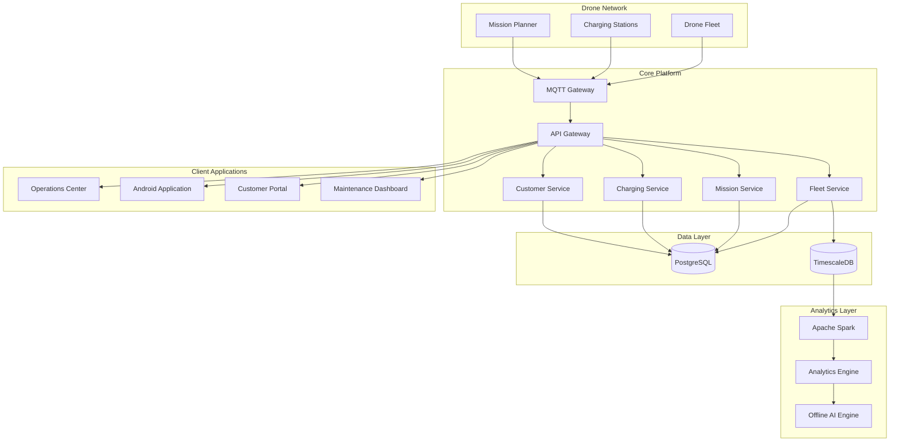
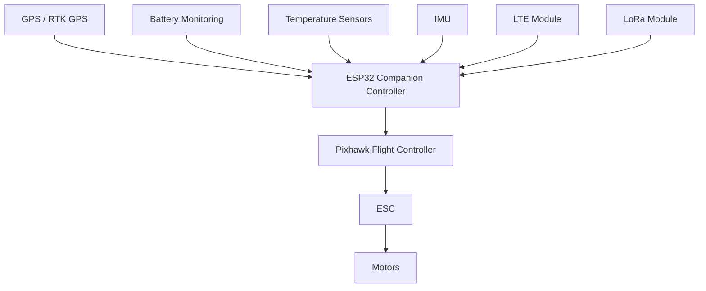
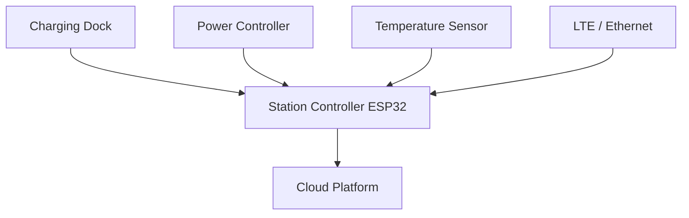

# Autonomous Drone Logistics Operating System


## Overview

Autonomous Drone Logistics Operating System (ADLOS) is a fleet management and autonomous delivery platform designed for medical logistics, emergency response, warehouse operations, and autonomous drone transportation.

The platform combines intelligent mission planning, real-time telemetry, charging station automation, fleet monitoring, predictive maintenance, and secure package delivery into a single operational ecosystem.

The system is designed around transparency, reliability, scalability, and operational safety.

---

## Key Capabilities

* Autonomous Mission Planning
* Real-Time Fleet Monitoring
* Intelligent Drone Assignment
* Charging Station Management
* Battery-Aware Route Planning
* Emergency Response Delivery
* OTP Secured Package Release
* Customer Tracking
* Offline AI Diagnostics
* Predictive Maintenance
* Fleet Analytics
* Realtime Operations Dashboard

---

## System Architecture



---

## Delivery Workflow

```mermaid
flowchart LR

    A[Customer Order]
    --> B[Order Validation]

    B --> C[Mission Planning]

    C --> D[Battery Analysis]

    D --> E[Drone Selection]

    E --> F[Mission Assignment]

    F --> G[Autonomous Flight]

    G --> H[OTP Verification]

    H --> I[Delivery Confirmation]

    I --> J[Charging Station Routing]

    J --> K[Mission Complete]
```



---

## Drone Hardware Architecture



---

## Charging Station Architecture



---

## Technology Stack

### Backend

* Python
* FastAPI
* MQTT
* WebSocket
* Redis

### Databases

* PostgreSQL
* TimescaleDB

### Analytics

* Apache Spark
* PySpark
* Apache Airflow

### Monitoring

* Prometheus
* Grafana

### Authentication

* Google OAuth
* JWT
* MFA

### Infrastructure

* Docker
* Docker Compose

### Embedded Systems

* ESP32
* ESP-IDF
* ArduPilot

---

## Security Model

The platform follows a Zero Trust Architecture.

Every component is authenticated and verified.

Security features include:

* Device Authentication
* Hardware Identity Validation
* TLS Encryption
* JWT Authentication
* Role Based Access Control
* OTP Package Verification
* Audit Logging
* Mission Authorization
* Secure Telemetry Channels

---

## Real-Time Monitoring

The Operations Center provides live visibility into:

* Drone Status
* Mission Status
* Charging Stations
* Battery Levels
* Signal Quality
* Hardware Health
* Fleet Utilization
* System Health

Status values are never estimated.

Every value displayed originates from:

* Telemetry
* Database Records
* Verified Service Responses

---

## Scalability Goals

Designed for:

* 10,000+ Drones
* 5,000+ Charging Stations
* Multi-Region Operations
* Millions of Daily Telemetry Events
* High Availability Deployments

---

## Project Structure

```text
adlos/

├── mobile/
├── backend/
├── firmware/
├── analytics/
├── airflow/
├── infrastructure/
├── monitoring/
├── databases/
├── docs/
├── tests/
└── deployment/
```

---

## Future Roadmap

* Autonomous Battery Swapping
* Dynamic Weather Routing
* Multi-Drone Coordination
* Smart Warehouse Integration
* Emergency Dispatch Automation
* AI Assisted Fleet Optimization
* Regional Drone Traffic Management

---

## License

Internal Development Project
All operational decisions must be validated through telemetry, mission safety rules, and system health verification.
