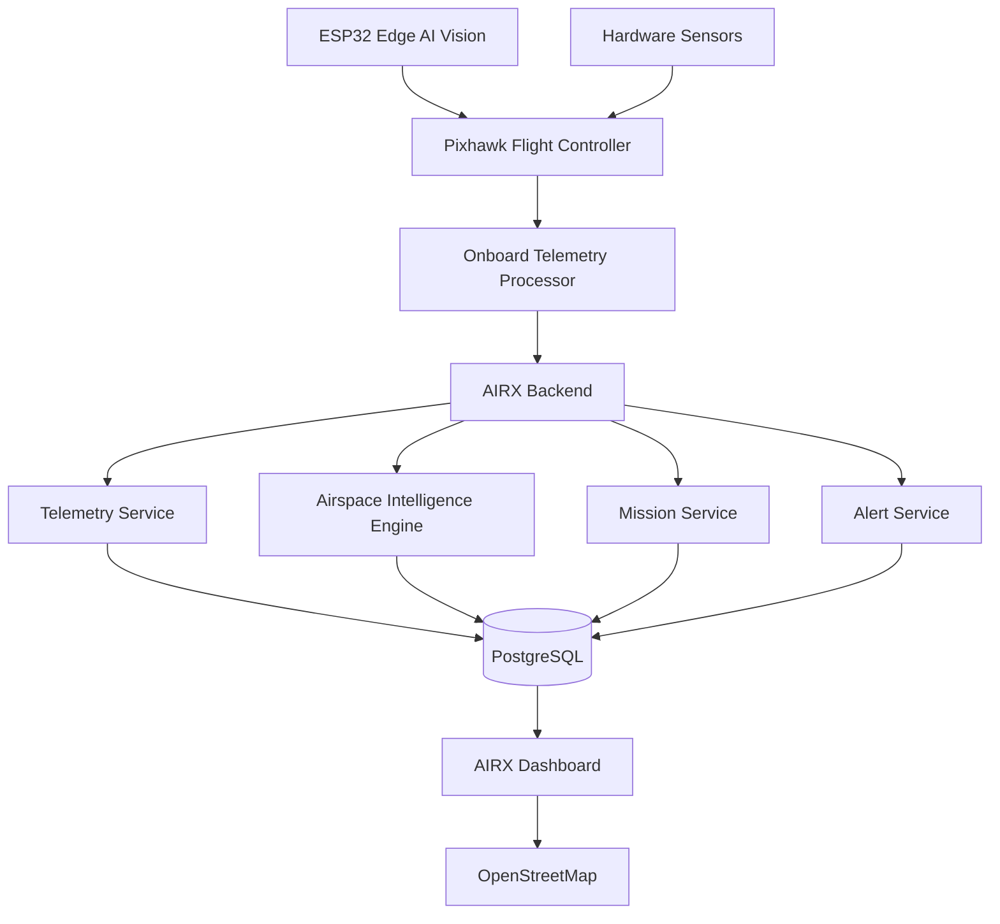
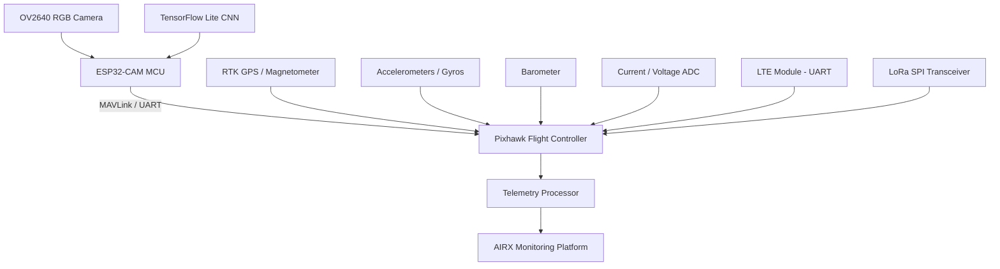

# AIRX Monitoring Platform


---

## Live Demo

**AIRX Monitoring Platform**

**Web Dashboard:** https://airx-monitoring.web.app

**System Status:** Online

---

## Introduction

AIRX Monitoring Platform is a real-time drone airspace intelligence and fleet monitoring system designed for autonomous drones, commercial drone operators, agriculture services, survey missions, infrastructure inspection, logistics operations, and emergency response activities.

The platform provides complete visibility into drone operations by combining telemetry monitoring, airspace intelligence, airport proximity awareness, geo-fencing, mission tracking, fleet analytics, and operational safety monitoring within a unified control center.

AIRX continuously receives telemetry from connected drones and visualizes flight activity on an interactive airspace map while monitoring battery health, signal quality, mission status, and operational risks.

The objective is to provide operators with real-time situational awareness and safer drone operations.

---

## System Architecture


## Drone Hardware Architecture

## Hardware Components
From an electronic and communications engineering perspective, the AIRX drone acts as a complex embedded system combining real-time flight stabilization with edge-computing computer vision.
### Flight Control System (The Main MCU)
| Component | Engineering Purpose |
|---|---|
| Pixhawk 6C / Cube Orange | The core processing unit. Utilizes 32-bit ARM Cortex-M7 microcontrollers to handle high-frequency sensor polling, PID control loops, and PWM signal generation to the Electronic Speed Controllers (ESCs). |
| IMU Sensor Fusion | Integrates data from multiple 3-axis accelerometers, gyroscopes, and magnetometers. Uses Extended Kalman Filters (EKF) to continuously estimate the drone's attitude (pitch, roll, yaw) and spatial orientation. |
### Edge AI & Vision System (Autonomous Control)
| Component | Engineering Purpose |
|---|---|
| ESP32-CAM Module | Acts as a secondary edge-compute node. The ESP32 is a dual-core microcontroller with built-in Wi-Fi and Bluetooth, interfacing directly with an OV2640 camera module via a parallel I2S interface. |
| Edge AI Processing | The ESP32 runs a lightweight Convolutional Neural Network (CNN) via frameworks like TensorFlow Lite Micro. By processing frames locally, it performs real-time object detection, obstacle avoidance, and human tracking without cloud latency. |
| "Human Drive" Emulation | Instead of relying solely on pre-programmed GPS waypoints, the ESP32 vision system analyzes the target (e.g., a human to track). It calculates positional offsets in the visual frame and translates them into directional vectors. These vectors are sent to the Pixhawk via UART using the MAVLink protocol, essentially allowing the AI to "fly" the drone with the fluid, adaptive corrections of a human pilot observing the environment. |
### Navigation & Sensor System
| Component | Engineering Purpose |
|---|---|
| RTK GPS Module | Uses Real-Time Kinematic positioning to correct standard GPS signal timing errors using a fixed base station, reducing spatial variance down to centimeter-level accuracy via serial UART communication. |
| Barometer | Measures precise atmospheric pressure changes via I2C/SPI interfaces to calculate absolute altitude variations. |
### RF & Telemetry System
| Component | Engineering Purpose |
|---|---|
| LoRa Transceiver (Sub-GHz) | Utilizes Chirp Spread Spectrum (CSS) modulation. It interfaces with the telemetry processor via SPI, offering exceptional receiver sensitivity for long-range, low-bandwidth data transmission (battery, GPS location) where cellular networks fail. |
| LTE Module | Interfaces via UART AT commands. Handles high-bandwidth HTTP/TCP payloads to stream complete telemetry data and potential compressed image feeds directly to the AIRX backend over cellular networks. |
### Power Management
| Component | Engineering Purpose |
|---|---|
| Current & Voltage Sensors | Utilizes onboard analog-to-digital converters (ADCs) to monitor precise voltage drops across a shunt resistor. This data computes real-time power consumption (Watts) and battery depletion rates. |
## What Problem Does AIRX Solve?
### Airspace Monitoring
 * Live airspace visibility
 * Airport proximity awareness
 * Restricted zone monitoring
 * Flight path tracking
 * Geo-fence monitoring
### Operational Safety
 * Battery health monitoring
 * Signal quality monitoring
 * Flight anomaly detection
 * Route deviation alerts
 * Emergency event awareness
### Fleet Management
 * Real-time drone tracking
 * Fleet utilization monitoring
 * Mission visibility
 * Operational analytics
 * Flight history tracking
### Mission Operations
 * Mission tracking
 * Route monitoring
 * Progress visibility
 * Operational alerts
 * Mission analytics
## Airspace Intelligence Engine
AIRX continuously evaluates drone locations against operational airspace zones.
### Green Zone
Safe operational area.
 * Normal flight operations
 * Recommended altitude up to 400 ft
 * No restrictions
### Yellow Zone
Caution area.
 * Increased monitoring
 * Airport proximity awareness
 * Additional operational review
### Red Zone
Restricted area.
 * Continuous monitoring
 * Operational alerts
 * Flight restriction awareness
## Airport Monitoring System
AIRX continuously monitors nearby airports and airspace boundaries.
Capabilities include:
 * Airport detection
 * Airport radius monitoring
 * Distance calculations
 * Airport safety awareness
 * Route risk evaluation
 * Airport proximity alerts
## GeoFence Monitoring
AIRX supports intelligent geo-fencing.
Monitored Events:
 * Zone Entry
 * Zone Exit
 * Route Deviation
 * Restricted Area Detection
 * Airport Proximity Detection
 * Boundary Violations
Generated alerts are immediately visible within the operations dashboard.
## Telemetry Monitoring
AIRX continuously receives telemetry data including:
 * Latitude
 * Longitude
 * Altitude
 * Speed
 * Heading
 * Battery Percentage
 * Battery Voltage
 * Battery Temperature
 * Signal Strength
 * GPS Accuracy
 * Flight Duration
 * Distance Travelled
 * Mission Status
All dashboard values originate directly from telemetry records. No estimated values are displayed.
## Operations Dashboard
The AIRX Operations Dashboard provides a centralized operational view of:
 * Real-Time Drone Locations
 * Airspace Zones
 * Airport Safety Areas
 * Mission Status
 * Fleet Health
 * Live Alerts
 * Battery Monitoring
 * Signal Quality Monitoring
 * GeoFence Monitoring
 * Flight History Analysis
The airspace map serves as the primary operational interface and occupies approximately 75% of the dashboard.
## Software Components
### Backend Services
| Service | Responsibility |
|---|---|
| Authentication Service | User authentication and authorization |
| Drone Service | Drone registration and management |
| Mission Service | Mission planning and execution |
| Airspace Service | Airspace intelligence and zone monitoring |
| Alert Service | Real-time alert generation |
| Analytics Service | Flight analytics and reporting |
| Audit Service | System audit tracking |
| Notification Service | Alert and notification delivery |
### Frontend Applications
| Application | Purpose |
|---|---|
| AIRX Web Dashboard | Fleet monitoring and operations |
| AIRX Admin Console | Administration and management |
| AIRX Operations Center | Real-time airspace monitoring |
## Technology Stack
### Backend
 * Java 21
 * Spring Boot
 * PostgreSQL
 * REST API
 * WebSocket
### Frontend
 * React
 * TypeScript
 * Material UI
 * Leaflet
### Authentication
 * Firebase Authentication
 * JWT
### Infrastructure
 * Firebase Hosting
 * Render
 * Docker
### Mapping
 * OpenStreetMap
 * GeoJSON
## Security Principles
AIRX follows a security-first operational architecture.
Implemented Controls:
 * Role-Based Access Control
 * JWT Authentication
 * Firebase Authentication
 * HTTPS Encryption
 * Audit Logging
 * Secure API Communication
 * Session Validation
## Project Structure
```text
airx-monitoring-platform/

├── backend/
├── frontend/
│   ├── airx-web/
│   └── airx-admin/
├── database/
├── gis/
├── infrastructure/
├── scripts/
├── streaming/
├── testing/
├── docs/
├── airflow/
├── docker/
└── README.md

```
## Future Roadmap
### Phase 1
 * Airspace Intelligence Engine
 * Telemetry Monitoring
 * Fleet Dashboard
### Phase 2
 * GeoFence Monitoring
 * Airport Awareness System
 * Mission Analytics
### Phase 3
 * Multi-Fleet Operations
 * Advanced Airspace Analytics
 * Predictive Monitoring
### Phase 4
 * AI Flight Risk Analysis
 * Autonomous Mission Planning
 * Advanced Operational Intelligence
## Future Vision
The long-term vision of AIRX is to become a unified drone operations platform capable of supporting logistics providers, agriculture operators, survey teams, emergency response agencies, inspection companies, and autonomous aerial operations through real-time airspace intelligence, operational visibility, and flight safety monitoring.
## License
This project is currently under active development.
All rights reserved.
